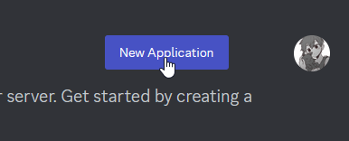
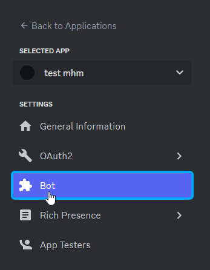
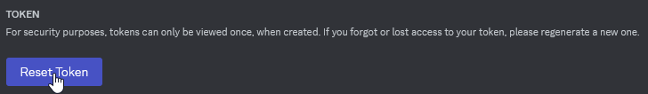
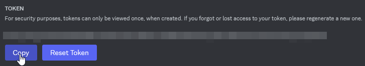
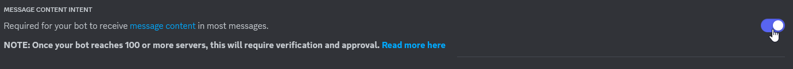
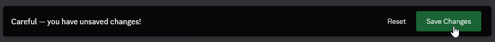

# OSCCord
Very simple little program for VRChat OSC, it takes the messages from a Discord Server (or servers) and outputs them to your chatbox.

##### Demonstrated by my good friend Envy!
 

## Instructions

### 1. Create a bot on Discord
Go to the [Discord Developer Portal](https://discord.com/developers) and login with your Discord account.

In the top right, click `New Application`.

Give your bot a lovely name, agree to the lifeless corporation's contract to your life (Click the checkbox), then click `Create`.

Click `Bot` in the array of buttons on the left

Feel free to give your bot a profile icon here.

Click `Reset Token` below the username box, then click `Copy`. Save your token somewhere safe.

Scroll down and click the switch next to `Message Content Intent` to enable it. This will allow your bot to read the content of your messages.

Click `Save Changes`.

### 2. Setup and run the program

Download the latest release of OSCCord [here](https://github.com/Morg-S9/aq-visualizer/releases), or  and extract it somewhere where it won't get tangled in with all your other files.

Launch VRChat before running OSCCord.

With VRChat open, run OSCCord. It will prompt you for your Discord Token. Copy your token again if you need to, paste it into the console window, then press Enter. 

Your bot should now be online and working!

## Running/Building from Source

Soon(tm)
